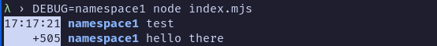
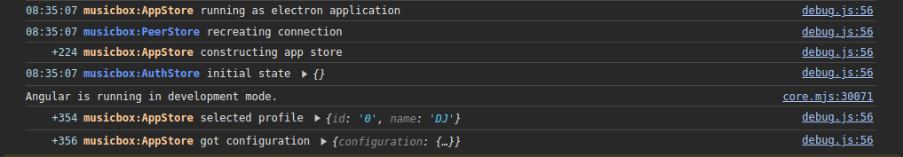

# @microphi/debug

> Super simple wrapper around console.log


# Install
```
@microphi/debug
```

## Use in nodejs

```javascript
import { getDebugger } from "@microphi/debug";

export const d = getDebugger('namespace1');

// any where in the code
d('test');
setTimeout(() => {
  d('hello there');
}, 500);
```
Set `DEBUG` environment variable with a comma separated list of regex: if a match happens with a namespace then the text will be logged using `console.log`.




## Use in the browser
Set `localStorage.debug` with a comma separated list of regex: if a match happens with a namespace then the text will be logged using `console.log`.



In this case `localStorage.debug` is set to `musicbox:*`

### OnMessage handler
With `OnMessage` is possible to handle each message logged regardless of the regexes provided. This may be usefull to send the logs to a server or to to store them to a file.

```javascript
onMessage((message) => {
  // do something
});
```
